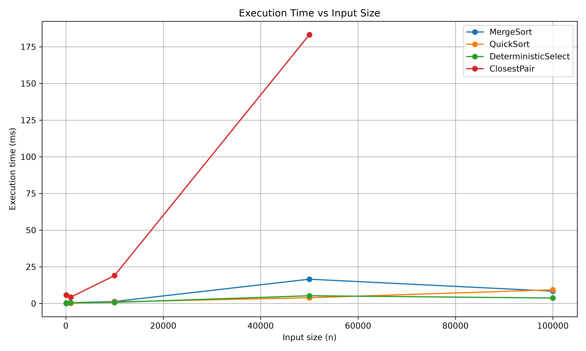
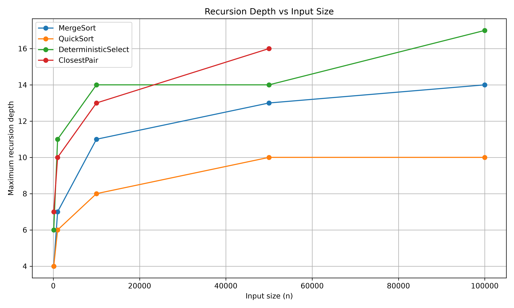

# Assignment 1: Divide-and-Conquer Algorithms

This report describes a Java project with four classic divide-and-conquer algorithms.

---

## A. Project Overview

### Purpose of the assignment

The goal of this assignment is to implement, test and compare four divide-and-conquer algorithms. For each algorithm I measure running time, recursion depth and extra metrics (comparisons, swaps, recursive calls). I also check if the experimental results match the theory (Big-O, recurrences, Master-Theorem/Akra–Bazzi).

The program writes results to `results/results.csv`. I ran tests on different input sizes and input types: random, sorted, reverse-sorted, and duplicate-heavy.

### Implemented algorithms

1. **MergeSort** - sorts an integer array. It uses a reusable buffer, a small insertion-sort cutoff (size 16), and it skips merge when the two halves are already in order.
2. **QuickSort** - sorts an integer array with a random pivot. After partition, it recurses on the **smaller** part first and loops on the larger part.
3. **Deterministic Select (Median-of-Medians)** - finds the *k*-th smallest element. The pivot is chosen with Median-of-Medians, so the worst-case time is linear.
4. **Closest Pair of Points** - finds the smallest Euclidean distance between two points in the plane using a divide-and-conquer method (sort by *x* and *y*, then check a strip).

---

## B. Algorithm Analysis

### 1. MergeSort

**How it works.**  
The algorithm splits the array into two halves, sorts each half and then merges them. If the current piece is small (length ≤ 16), it uses insertion sort. If `array[middle] ≤ array[middle + 1]`, the two halves are already sorted, so merge is not needed.

**Time / space complexity.**

| **Case** | **Time** | **Extra space** |
|:---|:---:|:---|
| Best / average / worst | Θ(*n* log *n*) | Θ(*n*) for the buffer, plus O(log *n*) stack |

Insertion sort on tiny pieces does not change the big-O. Sorted input is faster in practice because many merges are skipped, but the recurrence is still the same class.

**Recurrence and Master Theorem.**

$$
T(n) = 2T\left(\frac{n}{2}\right) + \Theta(n)
$$

Here, $a = 2$ and $b = 2$, so:

$$
\log_b a = \log_2 2 = 1
$$

The work outside the recursion is:

$$
f(n) = \Theta(n) = \Theta\left(n^{\log_b a}\right)
$$

This is Case 2 of the Master Theorem, so:

$$
T(n) = \Theta(n \log n)
$$

The recursion depth is approximately:

$$
\log_2 n
$$

### 2. QuickSort (random pivot, smaller-first)

**How it works.**  
A random index becomes the pivot. Partition puts smaller-or-equal values on the left. Then the method **recurses on the smaller side** and **iterates on the larger side** (`while` loop). This keeps the call stack small.

**Time / space complexity.**

| **Case** | **Time** | **Extra space (stack)** |
|:---|:---:|:---|
| Average (random pivot) | Θ(*n* log *n*) | O(log *n*) expected with smaller-first |
| Worst | Θ(*n*²) | O(log *n*) with smaller-first (not O(*n*)) |

The smaller-first trick does **not** change the running time. It only limits the recursion depth.

**Recurrence.**

After partition of size *n*, if the pivot rank is *q*:

$$
T(n) = T(q) + T(n-q-1) + \Theta(n)
$$

For a random pivot, the expected cost is:

$$
T(n) = \Theta(n \log n)
$$

In the worst case, with very unbalanced splits (for example, many duplicates with a `≤` partition), one side is almost empty:

$$
T(n) \approx T(n-1) + \Theta(n) = \Theta(n^2)
$$

Master Theorem does not apply directly because the split is not always *n*/2. Intuition from Akra–Bazzi: if splits stay near the middle on average, the “p-root” is 1 and extra work *n* gives \(n \log n\). If one split is always tiny, you get quadratic time.

### 3. Deterministic Select (Median-of-Medians)

**How it works.**  
To find the *k*-th smallest element:

1. Split the array into groups of 5 and sort each group.
2. Take the median of each group.
3. Recursively find the median of those medians. This value is the pivot.
4. Partition (less / equal / greater) and recurse only into the part that contains *k*.

**Time / space complexity.**

| **Case** | **Time** | **Extra space** |
|:---|:---:|:---|
| Worst case | Θ(*n*) | O(log *n*) stack (the subproblems get smaller by a constant factor) |

**Recurrence and Akra–Bazzi.**

$$
T(n) \le T\left(\frac{n}{5}\right) + T\left(\frac{7n}{10}\right) + \Theta(n)
$$

* $T(n/5)$: median of medians (about *n*/5 group medians).
* $T(7n/10)$: after a good pivot, at least about 30% of elements are thrown away, so at most 70% remain.

Akra–Bazzi (simple check): for $p = 1$,

$$
\left(\frac{1}{5}\right)^1 + \left(\frac{7}{10}\right)^1
= 0.2 + 0.7
= 0.9 < 1
$$

So the solution is **linear**:

$$
T(n) = \Theta(n)
$$

The Master Theorem with equal halves does not fit here, because the two recursive sizes are different.

### 4. Closest Pair of Points

**How it works.**  
Points are sorted by *x* and by *y*. The set is split by a vertical line. The algorithm solves left and right, then checks only points in a thin strip of width *δ* (the best distance so far). In the strip, each point is compared with only a few neighbours by *y*-coordinate. Tiny sets (*n* ≤ 3) use brute force.

**Time / space complexity.**

| **Case** | **Time** | **Extra space** |
|:---|:---:|:---|
| After O(*n* log *n*) sort | Θ(*n* log *n*) | Θ(*n*) for copies / strip |
| Naive brute force | Θ(*n*²) | Θ(1) |

**Recurrence and Master Theorem.**

$$
T(n) = 2T\left(\frac{n}{2}\right) + \Theta(n)
$$

Same as MergeSort: Case 2,

$$
T(n) = \Theta(n \log n)
$$

The strip check is $O(n)$ because each point has only a constant number of candidates. Recursion depth is:

$$
\Theta(\log n)
$$

For large *n*, Θ(*n* log *n*) is much faster than Θ(*n*²). Example: for *n* = 100,000, *n*² is about 10¹⁰ pair checks, while *n* log *n* is only a few million operations plus sorting.

---

## C. Experimental Results

Setup:

- Java implementation, metrics from `Experiment.java`
- Sizes for sorting and select: 100, 1,000, 10,000, 50,000, 100,000
- Closest Pair sizes: 100, 1,000, 10,000, 50,000
- Input types: Random, Sorted, Reverse-sorted, Duplicate-heavy (Closest Pair: Random and Duplicate-heavy)
- Times below are milliseconds (`time_ns / 1,000,000`) from `results/results.csv`

### Execution-time tables

> **Unit:** milliseconds (ms)  
> **Lower is better for execution time.**

#### MergeSort (ms)

| Input type | *n*=100 | *n*=1,000 | *n*=10,000 | *n*=50,000 | *n*=100,000 |
|------------|--------:|----------:|-----------:|-----------:|------------:|
| Random | 0.057 | 0.467 | 1.305 | 16.521 | 8.362 |
| Sorted | 0.011 | 0.088 | 0.092 | 0.206 | 0.387 |
| Reverse-sorted | 0.043 | 0.360 | 1.572 | 1.928 | 2.612 |
| Duplicate-heavy | 0.034 | 0.094 | 4.452 | 4.369 | 3.751 |

#### QuickSort (ms)

| Input type | *n*=100 | *n*=1,000 | *n*=10,000 | *n*=50,000 | *n*=100,000 |
|------------|--------:|----------:|-----------:|-----------:|------------:|
| Random | 0.396 | 0.144 | 1.033 | 3.896 | 9.267 |
| Sorted | 0.115 | 0.188 | 0.547 | 2.185 | 2.843 |
| Reverse-sorted | 0.066 | 0.127 | 1.325 | 2.750 | 3.939 |
| Duplicate-heavy | 0.162 | 0.405 | 4.401 | 112.002 | 423.128 |

#### Deterministic Select (ms), *k* = *n*/2

| Input type | *n*=100 | *n*=1,000 | *n*=10,000 | *n*=50,000 | *n*=100,000 |
|------------|--------:|----------:|-----------:|-----------:|------------:|
| Random | 0.118 | 0.525 | 0.722 | 5.243 | 3.688 |
| Sorted | 0.045 | 0.185 | 1.657 | 1.371 | 1.576 |
| Reverse-sorted | 0.047 | 0.186 | 2.814 | 1.610 | 1.934 |
| Duplicate-heavy | 0.020 | 0.075 | 1.951 | 0.911 | 2.053 |

#### Closest Pair (ms)

| **Input type** | **100** | **1,000** | **10,000** | **50,000** |
|:---|---:|---:|---:|---:|
| Random | 5.734 | 4.289 | 18.982 | 183.241 |
| Duplicate-heavy | 0.540 | 3.565 | 19.630 | 129.161 |

### Recursion-depth results

> **Unit:** maximum recursive-call depth  
> **Lower depth means a smaller call stack.**

Maximum recursion depth (from the CSV). MergeSort depth is the same for all input types because the split is always in the middle.

| Algorithm / type | 100 | 1,000 | 10,000 | 50,000 | 100,000 |
|------------------|----:|------:|-------:|-------:|--------:|
| MergeSort (all types) | 4 | 7 | 11 | 13 | 14 |
| QuickSort Random | 4 | 6 | 8 | 10 | 10 |
| QuickSort Sorted | 4 | 6 | 8 | 11 | 11 |
| QuickSort Reverse-sorted | 4 | 6 | 9 | 10 | 11 |
| QuickSort Duplicate-heavy | 3 | 3 | 3 | 3 | 3 |
| DeterministicSelect Random | 6 | 11 | 14 | 14 | 17 |
| DeterministicSelect Sorted | 7 | 10 | 13 | 13 | 15 |
| DeterministicSelect Reverse-sorted | 6 | 10 | 12 | 16 | 17 |
| DeterministicSelect Duplicate-heavy | 1 | 1 | 4 | 1 | 3 |
| ClosestPair (both types) | 7 | 10 | 13 | 16 | - |

Notes:

- MergeSort depth grows like log₂ *n* (for *n* = 100,000, log₂ *n* ≈ 16.6; measured 14 because of the size-16 cutoff).
- QuickSort depth stays small (about 10–11 at *n* = 100,000) because of smaller-first recursion.
- Duplicate-heavy QuickSort has **tiny depth (3)** but **very large time**, because the large side is handled in a loop, not with deep recursion.
- Closest Pair depth also follows log *n*.

### Results for different input sizes and types

- **Sorted MergeSort** is the fastest sorting case: almost no merges, few comparisons (*n*−1 after the cutoff logic).
- **Random** inputs give a smooth growth close to *n* log *n* for MergeSort and QuickSort.
- **Duplicate-heavy QuickSort** is the slowest: partition with `≤ pivot` puts almost all equal values on one side, so work is close to quadratic (423 ms at *n* = 100,000 vs about 9 ms on random data).
- **Deterministic Select** stays relatively fast on all types; duplicates often finish with a very small recursion depth because the three-way partition hits *k* inside the equal range.
- **Closest Pair** time grows faster than the sorting algorithms in the plot, mainly because of extra arrays, identity maps, and geometry work. Still, *n* = 50,000 finishes in a fraction of a second; a full *n*² scan would be much slower.

### Plots

**Time vs. *n*** (random inputs; Closest Pair stops at 50,000):

**Recursion depth vs. *n***:

---

## D. Discussion

**Do the results match theoretical complexity?**    

> Yes, mostly. MergeSort and QuickSort with random pivots generally grow like `n log n`. Their recursion depth also grows slowly, around `log n`.

> Deterministic Select does not show `n²` growth, and Closest Pair also performs much better than a quadratic solution for large inputs.

> Some results are not perfectly smooth. For example, one MergeSort test at 50,000 elements was slower than the test at 100,000. This can happen because of Java warm-up, garbage collection and other system activity.

**How does input structure affect performance?**  

> Different types of input can affect the algorithms differently.

> Sorted arrays help MergeSort because it can skip some merge steps. QuickSort also works well with sorted and reverse-sorted arrays because it uses a random pivot.

> Many duplicate values can make QuickSort much slower. However, duplicates can help Select because many equal values can be processed together.

> For Closest Pair, the positions of the points can change the work in the strip, but the recursion depth stayed the same in these tests.

**Why does smaller-first recursion help QuickSort?**    

> The algorithm uses recursion only for the smaller part and processes the larger part with a loop. This keeps the recursion depth at `O(log n)`.

> Without this approach, a bad split could create very deep recursion, up to `O(n)`, and cause a `StackOverflowError`.

> The running time can still be `O(n²)` in the worst case. Only the recursion depth is reduced.

**Why does Median-of-Medians guarantee O(n)?**  

> Median-of-Medians chooses the pivot in a way that guarantees a good split. After choosing the pivot, at least about 30% of the elements can be removed from further consideration.

> The algorithm also spends only `O(n)` time to create the groups and partition the array.

> So, in each step, the problem becomes much smaller while the work done at that step is still linear. This gives the recurrence:

> `T(n) ≤ T(n/5) + T(7n/10) + O(n)`

> Because the two recursive parts together are smaller than the original problem (`0.2 + 0.7 = 0.9`), the total running time is `O(n)`.

**Why is divide-and-conquer Closest Pair faster than O(*n*²) for large inputs?**  

> Brute force checks every pair. Divide-and-conquer only checks all pairs in tiny blocks and a strip. In the strip, *y*-order limits the inner loop to a constant number of neighbours. So extra work per level is O(*n*), and there are O(log *n*) levels.

**What practical factors affect performance?**  

> The results can be affected by several things. Java needs some time to warm up, so the first tests can be slower. Garbage collection can also slow down some tests. Other programs running on the computer can affect the results too.

> The tests are not always perfectly accurate because each test was run only once. Counting comparisons and other extra measurements can also make the algorithms slightly slower.

---

## E. Reflection

During the project, I focused on implementing algorithms correctly and testing them on different types of input. The main challenges were handling edge cases, debugging the algorithms and collecting reliable performance results.

I tested random, sorted, reverse-sorted and duplicate-heavy inputs, as well as large input sizes. The experiments showed how different input types can affect execution time and recursion depth. Some measurements were also affected by JVM warm-up and other system processes.

At the end, testing helped verify that the algorithms worked correctly and that the experimental results were generally consistent with the expected complexity.

---

## F. Screenshots

### Program output

The main program runs all experiments and writes `results/results.csv`.

### Test results

All testers finished with **ALL TESTS PASSED**.

**MergeSort**

**QuickSort**

**Deterministic Select**

**Closest Pair** (including a large test with *n* = 100,000)

### Plots / results

Full numeric data: [`results/results.csv`](results/results.csv).
